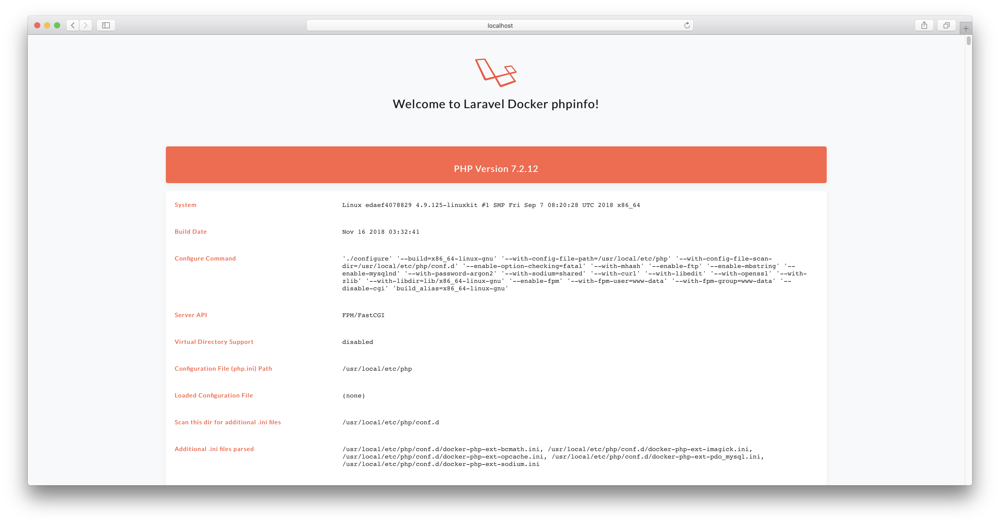

# Intro
This repo contains the source of PHP development environment for Docker.

* MySQL 8.x
* PHP 7.3.x
* Redis 5.0.x
* Docker compose file

# Install
* Install Docker [mac](https://store.docker.com/editions/community/docker-ce-desktop-mac) | [windows](https://store.docker.com/editions/community/docker-ce-desktop-windows) | [linux](https://docs.docker.com/install/linux/docker-ce/ubuntu/)

# Config
* Copy `.env.dist`  →  `.env`
* Set path to website in .`env` → `WWW_PATH`

# Start
`docker-compose up`

# Commands
(3rd arg → container name (php, nginx etc...))
* `docker-compose exec php php /code/artisan`

# MySQL
* MySQL host: `mysql` (127.0.0.1 from host)
* MySQL user: `laravel`
* MySQL password: `laravel`

and

* MySQL root user: `root`
* MySQL root password: `root`

